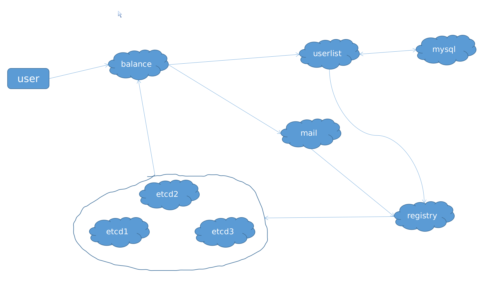
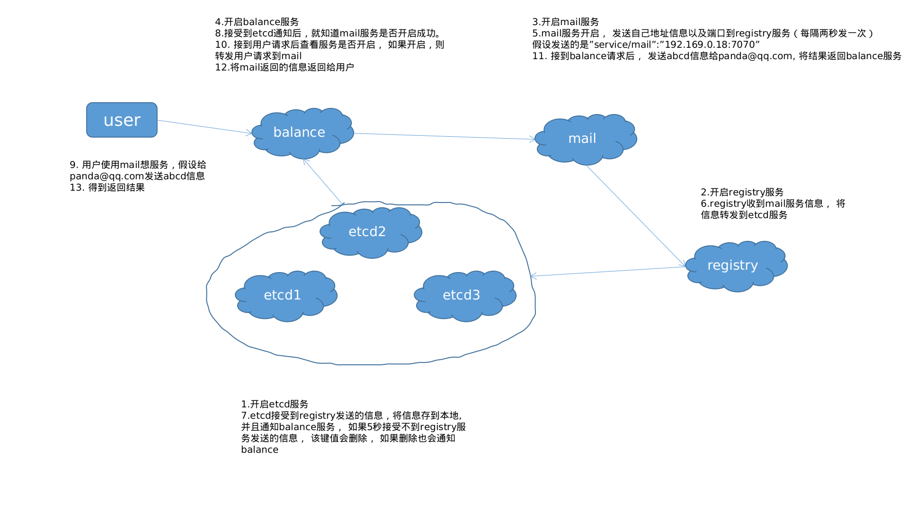

# 服务发现(etcd)示例, 包括邮件发送以及简单数据库操作(docker版本)

这篇文章主要是实现以etcd作为分布式数据库， 实现发送邮件以及增删邮件列表服务的项目， 项目支持docker。

在这之前需要知道[为什么需要服务发现](https://stackoverflow.com/questions/37148836/what-is-service-discovery-and-why-do-you-need-it
)， 以及服务发现常用的格式。该项目实现的是[Server-side service discovery](https://microservices.io/patterns/server-side-discovery.html)， 本来是想实现`client-registration`的， 后来我发现`nodejs`的etcd库太难用了， 就改成`service-registration`。 不知道这些也没关系， 整个项目的架构是特别容易理解的。

### 项目架构图

### 服务介绍

项目可以分为5个服务

- balance: 负责用户发送来的请求。
- etcd: 包括etcd1， etcd2， etcd3， 做键值存储。
- mail: 负责发送邮件。
- userlist: 包括userlist, mysql, 存储邮件地址。
- registry： 负责往etcd注册键值对。 

#### etcd服务

etcd 就是一个分布式key-value存储工具， 像redis一样。 共识算法使用的是raft协议， 因此比较好理解。它还具有通知功能， 就是当值发生变化的时候会通知监听它的程序。

项目中的作用： 

1. 存储`mail`服务跟`userlist`服务在网络中的地址和端口，比如mail服务， 如果开启之后会在etcd中存储 `key = service/mail, value = 192.169.0.10:7070`, 这样才能找见`mail`服务在网络中的位置， 以便`balance`调用。

2. 通知`balance`服务，这样用户请求发送email的时候， `balance`服务会知道`mail`服务的网络及端口， 然后调用。

#### registry服务

1. 接受业务服务器发送的注册服务地址的请求。
2. 将请求发送到etcd。

我们可以把`mail`跟`userlist`看做业务， 每个业务可能使用不同的语言， 而`etcd`服务使用的`grpc`接口， 这样不同语言可能会有一些出入。 所以加了一层`registry`服务， 该服务将业务网络地址信息发送`etcd`服务。

比如`mail`服务如果开启之后， 会将`key = service/mail, value = 192.169.0.10:7070`发送到`registry`， `registry`将信息发到`etcd`服务。

#### mail 服务

1. 接受`balance`发送来的请求
2. 往`registry`服务注册服务地址

`balance`会发送email（abc@qq.com）地址， 要发送的信息(hello world)给`mail`服务器， 然后`mail`服务器负责处理这些信息

`mail`服务器打开之后会启动一个服务， 该服务每隔2秒钟向`registry`发送服务地址心跳

#### userlist 服务

跟`mail`服务类似

1. 接受`balance`发送来的请求
2. 往`registry`服务注册服务地址

`balance`会发送用户名称， 用户`email`给`userlist`服务器， 然后`userlist`服务器将信息存入`mysql`服务器中， 方便以后查询

`userlist`服务器打开之后会启动一个服务， 该服务每隔2秒钟向`registry`发送改服务地址心跳

#### balance 服务

1. 接受用户发送的请求
2. 如果请求的服务存在， 转发该请求。 如果不存在， 通知用户服务未开启

### 服务流程

接下来， 以`mail`服务为例， 看下整个服务是怎样运行的。

根据图里面的编号看。

### 怎样做

项目地址： https://github.com/papandadj/service-discovery
         
`mail`服务使用的`nodejs`写的， 其他的都是用`golang`语言写的， 因为上面需要开启8个服务， 所以整个环境我都写成了docker镜像。 在docker里面设置了局域网， 每个服务用独立的ip。 在项目doc文件夹里面有关于docker创建容器以及手动搭建的方式。

