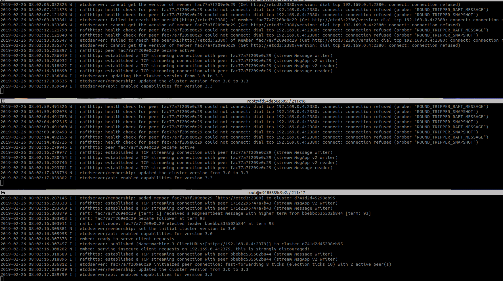
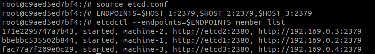

# 创建etcd镜像

etcd因为官网没有提供, 所以自己创建一个etcd镜像,

#### 1. [下载etcd](https://github.com/etcd-io/etcd/releases)

我用的是这个版本: `etcd-v3.3.12-linux-amd64.tar.gz`

#### 2. 解压

#### 3. 使用`docker cp ` 将文件拉到容器里面

#### 4. export etcd 目录

上面的具体操作步骤可以参照 mail镜像的构建方法

### 运行

etcd容器构建的时候, 也可以直接将etcd.conf文件拉到镜像里面.

因为etcd是分布式的. 所以需要先构建自己的网络.

#####  1. 构建局域网络
`docker network create --subnet=192.169.0.0/20 service-discovery`
当前构建网络可以运行20个机器, 网络的名称是`service-discovery`.

使用`docker network inspect service-discovery`查看当前网络运行的机器.

####  2.在局域网里面运行etcd容器
启动第一个容器
`docker run --ip=192.169.0.2 -it --network=service-discovery --name=etcd1 service-etcd:1.0.0 bash`
**注意: 192.169.0.1不能使用, 是网关的.**
第一台机器运行
进入容器里面, 运行
```bash
source etcd.conf
THIS_NAME=${NAME_1}
THIS_IP=192.169.0.2
etcd --data-dir=data.etcd --name ${THIS_NAME} \
	--initial-advertise-peer-urls http://${THIS_IP}:2380 --listen-peer-urls http://${THIS_IP}:2380 \
	--advertise-client-urls http://${THIS_IP}:2379 --listen-client-urls http://${THIS_IP}:2379 \
	--initial-cluster ${CLUSTER} \
	--initial-cluster-state ${CLUSTER_STATE} --initial-cluster-token ${TOKEN}
```

启动第二个容器
`docker run --ip=192.169.0.3 -it --network=service-discovery --name=etcd2 service-etcd:1.0.0 bash`

进入容器里面, 运行
```bash
source etcd.conf
THIS_NAME=${NAME_2}
THIS_IP=192.169.0.3
etcd --data-dir=data.etcd --name ${THIS_NAME} \
	--initial-advertise-peer-urls http://${THIS_IP}:2380 --listen-peer-urls http://${THIS_IP}:2380 \
	--advertise-client-urls http://${THIS_IP}:2379 --listen-client-urls http://${THIS_IP}:2379 \
	--initial-cluster ${CLUSTER} \
	--initial-cluster-state ${CLUSTER_STATE} --initial-cluster-token ${TOKEN}
```

启动第三个容器
`docker run --ip=192.169.0.4 -it --network=service-discovery --name=etcd3 service-etcd:1.0.0 bash`

进入容器里面, 运行
```bash
source etcd.conf
THIS_NAME=${NAME_3}
THIS_IP=192.169.0.4
etcd --data-dir=data.etcd --name ${THIS_NAME} \
	--initial-advertise-peer-urls http://${THIS_IP}:2380 --listen-peer-urls http://${THIS_IP}:2380 \
	--advertise-client-urls http://${THIS_IP}:2379 --listen-client-urls http://${THIS_IP}:2379 \
	--initial-cluster ${CLUSTER} \
	--initial-cluster-state ${CLUSTER_STATE} --initial-cluster-token ${TOKEN}
```
这三台机器跑起来后, 整个etcd就开始工作, 当然一个也工作, 开三个机器是为了有保障.
全部跑完之后是这个样子


#### 简单的etcd操作
不要关闭上面三个窗口
使用`docker container ls`找到正在运行的etcd容器
然后随便进入一个容器里面, 假设进入第一个
`docker exec -it etcd1 bash`

进去后执行:
1. 使用client3 接口 `export ETCDCTL_API=3`
2. 将配置条件初始化 `source etcd.conf`
3. 指定etcd客户端终端 `ENDPOINTS=$HOST_1:2379,$HOST_2:2379,$HOST_3:2379`
4. 这样就可以正常访问了, 查看etcd状态: `etcdctl --endpoints=$ENDPOINTS member list`




### [etcd 详细操作](https://github.com/etcd-io/etcd/blob/master/Documentation/demo.md)