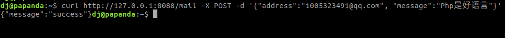
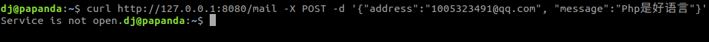

# etcd 服务发现, docker开发

## Os
`Linux`, `MacOs`, `windows`

## Preinstalled

`docker`,  `docker-compose`

## Summary

该软件使用docker容器, 实现etcd服务发现功能.

服务包括两个,
1. userlist服务: 第一个是email信息的增删查改.
2. email服务: 用户发给别人发送email.

[详细介绍](./doc/doc.md)

## Usage example

* ##### 获取仓库代码.
 `git clone git@github.com:papandadj/service-discovery.git`
* ##### 修改`mail`服务配置. 
    ```bash
        cd service-mail
        vi config.js
    ```
    修改 `mailUser`, `mailPass`, `mailFrom`为自己qq邮箱的配置, 如果不是qq邮箱则自己配置
    `mailUser`: qq邮箱
    `mailPass`: 不是邮箱密码, 在qq邮箱-> 设置 -> pop3... -> 开启服务里面查询.
    `mailFrom`: 你的这个
    

* ##### 编译镜像 `make build`.
* ##### 启动服务 `make run`.
* ##### 交互
    1. 给userlist插入一条记
        `curl http://127.0.0.1:8080/userlist -X POST -d '{"method":"put","name":"dong", "email": "papand@gmail.com"}'`
    2. 获取该条记录
        `curl http://127.0.0.1:8080/userlist -X POST -d '{"method":"get","name":"dong"}'`
        

    3. 给其他邮箱发送消息, 将下面邮箱改成自己的
        `curl http://127.0.0.1:8080/mail -X POST -d '{"address":"1005323491@qq.com", "message":"Php是好语言"}'`

        

    4. 关闭mail 容器再尝试发, 就会显示发送失败
        `docker stop mail`
        再发送会显示失败
        
    

